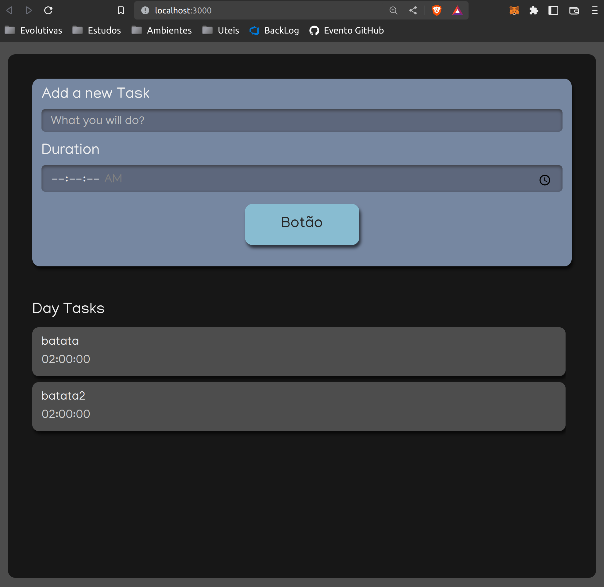

# Projeto de Estudo do Alura

WIP!

# Branches e Commits

### Branches

Deve se utilizar um padrão no gerenciamento de branches para facilitar o ciclo de
`desenvolvimento -> deploy do projeto` e facilitar que múltiplos desenvolvedores
possam trabalhar em conjunto numa mesma feature reduzindo os conflitos na base de código.

#### Nomenclatura Branches

Deve-se utilizar o seguinte padrão:

- Branch de feature: feat/<nome>
- Branch de bugfix: fix/<descrição>
- Branch de refatoração: refactor/<descrição>

### Commits

Deve se utilizar um padrão nas mensagens de commits para facilitar no processo de
revisão e na escrita de boas notas de versão(release notes).

#### Nomenclatura Commits

Deve-se utilizar o seguinte padrão:

- `feat`: para introdução de uma nova feature;
- `chore`: para alteração de algo que não impacte o usuário, alteração no procedimento
de build ou ferramentas auxiliares de desenvolvimento;
- `fix`: para correção de bugs;
- `refactor`: para um commit que não adiciona uma nova feature e nem corrige um bug;
- `test`: para adição de testes faltantes ou correção de testes existentes;
- `perf`: para alterações que visem a melhora de performance;
- `docs`: para alteração de documentação;
- `style`: para um commit que não altera comportamento de código, apenas estilo;
- `wip`: Caso seja necessario parar o que esta sendo desenvolvido para realizar uma 
correção, deve-se comitar com wip(work in progress)

Por exemplo:
> feat: added contribution date

A app to control applying

Author: Renan Ponick